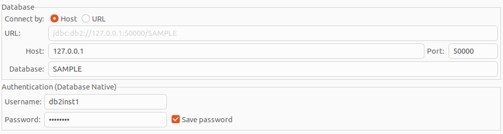

# IBM DB2

https://www.ibm.com/docs/en/db2oc?topic=psdf-verifying-python-driver-sqlalchemy-adapter-django-adapter-installation

## Create new db
https://www.ibm.com/docs/en/db2/11.5?topic=linux-testing-your-db2-community-edition-docker-image-installation-systems
1. `make enter`
2. `su - db2inst1`
3. `db2 create db testdb3`